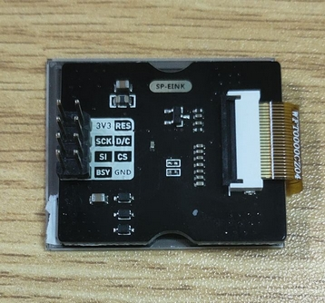
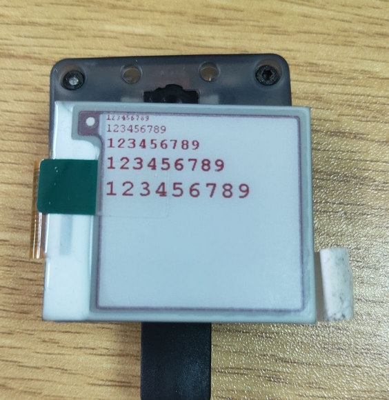
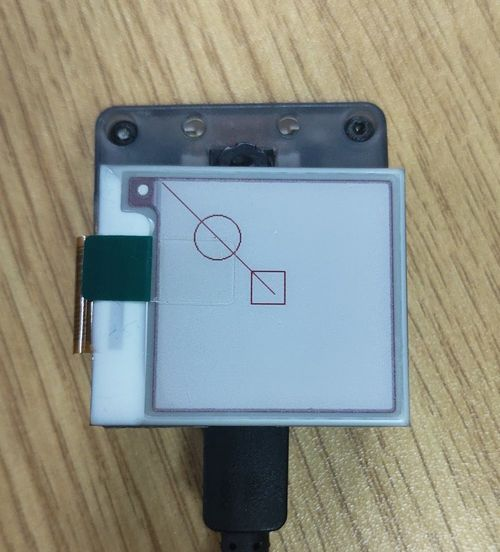

# SP_EINK Module User Guide

[中文](README_CN.md)

## Directory Structure
| Directory | Description                                   |
| :-------: | :-------------------------------------------- |
|    doc    | Reference documentation                       |
|    img    | Images                                        |
|  script   | Maixpy script example                         |
|    src    | C program example based on the standalone sdk |

## Introduce

SP_EINK module USES GDEW0154M09, which is a 1.54 ", SPI interface control, with 24P FPC(0.5mm spacing) interface e-ink screen. Has a wide range of views. This module uses the SP_MOD SPI interface to connect to mcu.


*See [SP-EINK规格书V1.0.pdf](doc/SP-EINK规格书V1.0.pdf) for more information.*

## Mode of connection

|   MCU    | SP_EINK |
| :------: | :-----: |
|   RES    |   RES   |
|   D/C    |   D/C   |
|    CS    |   CS    |
|   SCK    |   SCK   |
|   MOSI   |   SI    |
|   BSY    |   BSY   |
| 2.3-3.6V |  3.3V   |
|   GND    |   GND   |

## Pin figure



## MCU configuration

### IO Port configuration

Configure the IO port corresponding to the schematic diagram as SPI function

* C

  ```c
  fpioa_set_function(SPI_IPS_LCD_CS_PIN_NUM, FUNC_SPI1_SS0);   // CS
  fpioa_set_function(SPI_IPS_LCD_SCK_PIN_NUM, FUNC_SPI1_SCLK); // SCLK
  fpioa_set_function(SPI_IPS_LCD_MOSI_PIN_NUM, FUNC_SPI1_D0);  // MOSI
  
  fpioa_set_function(SPI_IPS_LCD_DC_PIN_NUM, FUNC_GPIOHS0 + SPI_IPS_LCD_DC_GPIO_NUM);   // D2
  fpioa_set_function(SPI_IPS_LCD_RST_PIN_NUM, FUNC_GPIOHS0 + SPI_IPS_LCD_RST_GPIO_NUM); // D3
  fpioa_set_function(SPI_IPS_LCD_BL_PIN_NUM, FUNC_GPIOHS0 + SPI_IPS_LCD_BL_GPIO_NUM);   // D2
  
  gpiohs_set_drive_mode(SPI_IPS_LCD_DC_GPIO_NUM, GPIO_DM_OUTPUT);
  gpiohs_set_drive_mode(SPI_IPS_LCD_RST_GPIO_NUM, GPIO_DM_OUTPUT);
  
  gpiohs_set_pin(SPI_IPS_LCD_DC_GPIO_NUM, GPIO_PV_HIGH);
  gpiohs_set_pin(SPI_IPS_LCD_RST_GPIO_NUM, GPIO_PV_HIGH);
  
  gpiohs_set_drive_mode(SPI_IPS_LCD_BL_PIN_NUM, GPIO_DM_INPUT_PULL_UP);
  gpiohs_set_pin_edge(SPI_IPS_LCD_BL_PIN_NUM, GPIO_PE_BOTH);
  ```

* MaixPy

  ```python
  fm.register(20, fm.fpioa.GPIOHS20, force=True) # #define SPI_IPS_LCD_SS_PIN_NUM 20
  fm.register(15, fm.fpioa.GPIOHS15, force=True) # #define SPI_IPS_LCD_DC_PIN_NUM 15
  fm.register(6, fm.fpioa.GPIOHS6, force=True) # #define SPI_IPS_LCD_BUSY_PIN_NUM 6
  fm.register(7, fm.fpioa.GPIOHS7, force=True) # #define SPI_IPS_LCD_RST_PIN_NUM 7
  
  cs = GPIO(GPIO.GPIOHS20, GPIO.OUT)
  dc = GPIO(GPIO.GPIOHS15, GPIO.OUT)
  busy = GPIO(GPIO.GPIOHS6, GPIO.IN, GPIO.PULL_DOWN)
  rst = GPIO(GPIO.GPIOHS7, GPIO.OUT)
  ```

### SPI initalization

* C

  ```c
  spi_init(1, SPI_WORK_MODE_0, SPI_FF_STANDARD, DATALENGTH, 0);
  ```

* MaixPy

  ```python
  spi1 = SPI(SPI.SPI1, mode=SPI.MODE_MASTER, baudrate=600 * 1000,
              polarity=0, phase=0, bits=8, firstbit=SPI.MSB, sck=21, mosi=8)
  ```

## SP_EINK configuration

### AT instruction list

| Instruction |       description        |
| :---------: | :----------------------: |
|    0x10     | start transport b/w data |
|    0x13     | start transport r/w data |
|    0x12     |  refresh data to screen  |

*See [GDEW0154M09.pdf](doc/GDEW0154M09.pdf) for more information*

### Method of application

* Process

  1. initializatin
  2. create a image and fill it
  3. send image and refresh

* C

  ```c
  EPD_DisplayInit(); //EPD init
  
  //Paint initialization
  Paint_NewImage(BlackImage, EPD_WIDTH, EPD_HEIGHT, 270, WHITE); //Set screen size and display orientation
  Paint_SelectImage(BlackImage);                                 //Set the virtual canvas data storage location
  
  Paint_Clear(WHITE); //clear paint
  Paint_DrawString_EN(0, 0, "sipeed", &Font8, WHITE, BLACK);   //5*8
  Paint_DrawString_EN(0, 10, "sipeed", &Font12, WHITE, BLACK); //7*12
  Paint_DrawString_EN(0, 25, "sipeed", &Font16, WHITE, BLACK); //11*16
  Paint_DrawString_EN(0, 45, "sipeed", &Font20, WHITE, BLACK); //14*20
  Paint_DrawString_EN(0, 80, "sipeed", &Font24, WHITE, BLACK); //17*24
  EPD_FullDisplay(BlackImage, BlackImage, 0);                  //display image
  ```
  
* MaixPy

  ```python
  epd = EPD(spi1, cs, dc, rst, busy)

  epd.init()
  img = image.Image()
  img = img.resize(200, 200)

  img.draw_line(0, 0, 100, 100)
  img.draw_circle(50, 50, 20)
  img.draw_rectangle(80, 80, 30, 30)

  epd.display(img)
  
  ```

## Runtime enviroments

| Language |  Boards  |      SDK/firmware version      |
| :------: | :------: | :----------------------------: |
|    C     | MaixCube | kendryte-standalone-sdk v0.5.6 |
|  MaixPy  | MaixCube |         maixpy v0.5.1          |

*The MaixPy firmware is recommended to compile from the latest source*

### Result

* C

  

* MaixPy

  

## LICENSE

See [LICENSE](LICENSE.md) file

## Othre information

| Version |   Editor   |
| :-----: | :--------: |
|  v0.1   | vamoosebbf |