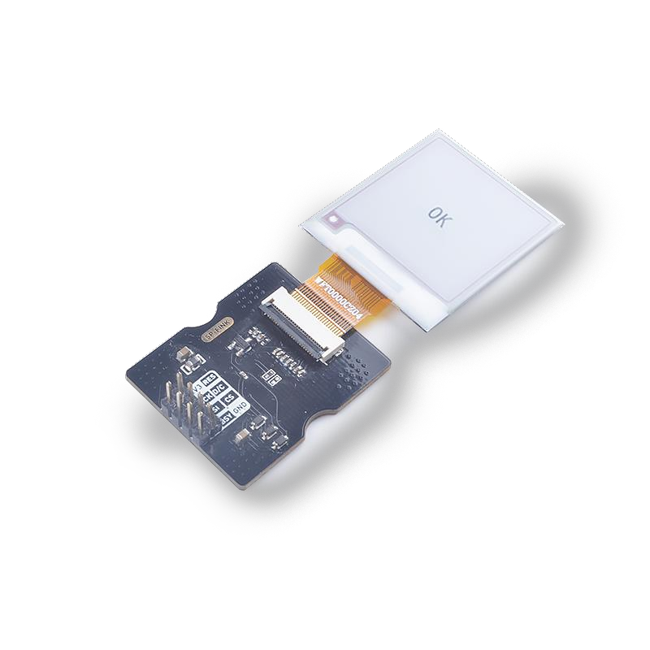

# SP_EINK模块使用说明

## 介绍

SP_EINK模块采用GDEW0154M09，这是一款 1.54”，SPI 接口控制，拥有 24P FPC(0.5mm 间距)接口的电子墨水屏。拥有超广可视角。该模块使用SP_MOD SPI接口与开发板相连



## 接线方式

|   MCU    | SP_EINK |
| :------: | :-----: |
|   RES    |   RES   |
|   D/C    |   D/C   |
|    CS    |   CS    |
|   SCK    |   SCK   |
|   MOSI   |   SI    |
|   BSY    |   BSY   |
| 2.3-3.6V |  3.3V   |
|   GND    |   GND   |


## MCU端口配置

### IO口配置

将原理图对应的IO口配置为SPI功能

* C示例

  ```c
  fpioa_set_function(SPI_IPS_LCD_CS_PIN_NUM, FUNC_SPI1_SS0);   // CS
  fpioa_set_function(SPI_IPS_LCD_SCK_PIN_NUM, FUNC_SPI1_SCLK); // SCLK
  fpioa_set_function(SPI_IPS_LCD_MOSI_PIN_NUM, FUNC_SPI1_D0);  // MOSI
  
  fpioa_set_function(SPI_IPS_LCD_DC_PIN_NUM, FUNC_GPIOHS0 + SPI_IPS_LCD_DC_GPIO_NUM);   // D2
  fpioa_set_function(SPI_IPS_LCD_RST_PIN_NUM, FUNC_GPIOHS0 + SPI_IPS_LCD_RST_GPIO_NUM); // D3
  fpioa_set_function(SPI_IPS_LCD_BL_PIN_NUM, FUNC_GPIOHS0 + SPI_IPS_LCD_BL_GPIO_NUM);   // D2
  
  gpiohs_set_drive_mode(SPI_IPS_LCD_DC_GPIO_NUM, GPIO_DM_OUTPUT);
  gpiohs_set_drive_mode(SPI_IPS_LCD_RST_GPIO_NUM, GPIO_DM_OUTPUT);
  
  gpiohs_set_pin(SPI_IPS_LCD_DC_GPIO_NUM, GPIO_PV_HIGH);
  gpiohs_set_pin(SPI_IPS_LCD_RST_GPIO_NUM, GPIO_PV_HIGH);
  
  gpiohs_set_drive_mode(SPI_IPS_LCD_BL_PIN_NUM, GPIO_DM_INPUT_PULL_UP);
  gpiohs_set_pin_edge(SPI_IPS_LCD_BL_PIN_NUM, GPIO_PE_BOTH);
  ```

* MaixPy示例

  ```python
  fm.register(20, fm.fpioa.GPIOHS20, force=True) # #define SPI_IPS_LCD_SS_PIN_NUM 20
  fm.register(15, fm.fpioa.GPIOHS15, force=True) # #define SPI_IPS_LCD_DC_PIN_NUM 15
  fm.register(6, fm.fpioa.GPIOHS6, force=True) # #define SPI_IPS_LCD_BUSY_PIN_NUM 6
  fm.register(7, fm.fpioa.GPIOHS7, force=True) # #define SPI_IPS_LCD_RST_PIN_NUM 7
  
  cs = GPIO(GPIO.GPIOHS20, GPIO.OUT)
  dc = GPIO(GPIO.GPIOHS15, GPIO.OUT)
  busy = GPIO(GPIO.GPIOHS6, GPIO.IN, GPIO.PULL_DOWN)
  rst = GPIO(GPIO.GPIOHS7, GPIO.OUT)
  ```

### SPI初始化


* C示例

  ```c
  spi_init(1, SPI_WORK_MODE_0, SPI_FF_STANDARD, DATALENGTH, 0);
  ```

* MaixPy示例

  ```python
  spi1 = SPI(SPI.SPI1, mode=SPI.MODE_MASTER, baudrate=600 * 1000,
              polarity=0, phase=0, bits=8, firstbit=SPI.MSB, sck=21, mosi=8)
  ```

## SP_EINK 配置

### 基本指令列表

| 指令  |       功能       |
| :---: | :--------------: |
| 0x10  | 开始发送黑白图像 |
| 0x13  | 开始发送红白图像 |
| 0x12  |  刷新图像到屏幕  |

*更多指令信息参考[GDEW0154M09.pdf](doc/GDEW0154M09.pdf)*

### 使用方式

* 流程

  1. 初始化配置
  2. 创建Paint并填充图像
  3. 发送图像并刷新

* C示例

  ```c
  EPD_DisplayInit(); //EPD init
  
  //Paint initialization
  Paint_NewImage(BlackImage, EPD_WIDTH, EPD_HEIGHT, 270, WHITE); //Set screen size and display orientation
  Paint_SelectImage(BlackImage);                                 //Set the virtual canvas data storage location
  
  Paint_Clear(WHITE); //clear paint
  Paint_DrawString_EN(0, 0, "sipeed", &Font8, WHITE, BLACK);   //5*8
  Paint_DrawString_EN(0, 10, "sipeed", &Font12, WHITE, BLACK); //7*12
  Paint_DrawString_EN(0, 25, "sipeed", &Font16, WHITE, BLACK); //11*16
  Paint_DrawString_EN(0, 45, "sipeed", &Font20, WHITE, BLACK); //14*20
  Paint_DrawString_EN(0, 80, "sipeed", &Font24, WHITE, BLACK); //17*24
  EPD_FullDisplay(BlackImage, BlackImage, 0);                  //display image
  ```
  
* MaixPy示例

  ```python
  epd = EPD(spi1, cs, dc, rst, busy)

  epd.init()
  img = image.Image()
  img = img.resize(200, 200)

  img.draw_line(0, 0, 100, 100)
  img.draw_circle(50, 50, 20)
  img.draw_rectangle(80, 80, 30, 30)

  epd.display(img)
  
  ```


