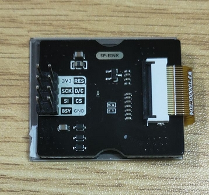
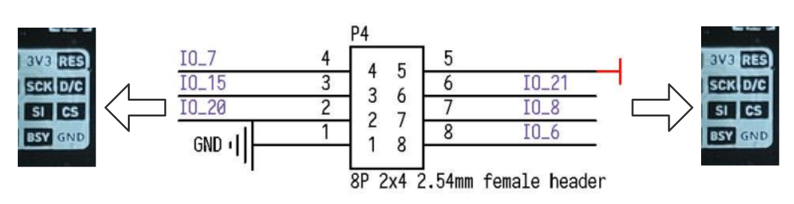

# SP_EINK 模块使用说明

[ENGLISH](README.md)

## 目录结构

|  目录  | 描述           |
| :----: | :------------- |
|  doc   | 参考文档       |
|  img   | 图片           |
| script | MaixPy脚本示例 |
|  src   | C裸机程序示例  |

## 介绍


SP_EINK 模块采用 GDEW0154M09，这是一款 1.54”，SPI 接口控制，拥有 24P FPC(0.5mm 间距)接口的电子墨水屏。拥有超广可视角。该模块使用SP_MOD SPI 接口与开发板相连.

*更多详细特性参考[SP-EINK规格书V1.0.pdf](doc/SP-EINK规格书V1.0.pdf)*

## 引脚图



## 接线方式



|  MCU:FUN(IO)   | SP_EINK |
| :------------: | :-----: |
|  GPIOHS(IO_7)  |   RES   |
| SPIOHS(IO_15)  |   D/C   |
| SPIOHS(IO_20)  |   CS    |
| SPI:SCK(IO_21) |   SCK   |
| SPI:MOSI(IO_8) |   SI    |
|  GPIOHS(IO_6)  |   BSY   |
|    2.3-3.6V    |  3.3V   |
|      GND       |   GND   |

## MCU 配置

### IO 口配置

将原理图对应的 IO 口配置为 SPI 功能

* C

  ```c
  fpioa_set_function(SPI_EINK_CS_PIN_NUM, FUNC_SPI1_SS0);   // SPI_EINK_CS_PIN_NUM: 20; 
  fpioa_set_function(SPI_EINK_SCK_PIN_NUM, FUNC_SPI1_SCLK); // SPI_EINK_SCK_PIN_NUM: 21;
  fpioa_set_function(SPI_EINK_MOSI_PIN_NUM, FUNC_SPI1_D0);  // SPI_EINK_MOSI_PIN_NUM: 8;
  
  fpioa_set_function(SPI_EINK_DC_PIN_NUM, FUNC_GPIOHS0 + SPI_EINK_DC_GPIO_NUM);   // SPI_EINK_DC_PIN_NUM: 21;
  fpioa_set_function(SPI_EINK_RST_PIN_NUM, FUNC_GPIOHS0 + SPI_EINK_RST_GPIO_NUM); // SPI_EINK_RST_PIN_NUM: 7;
  fpioa_set_function(SPI_EINK_BL_PIN_NUM, FUNC_GPIOHS0 + SPI_EINK_BL_GPIO_NUM);   // SPI_EINK_BL_PIN_NUM: 6;
  
  gpiohs_set_drive_mode(SPI_EINK_DC_GPIO_NUM, GPIO_DM_OUTPUT);
  gpiohs_set_drive_mode(SPI_EINK_RST_GPIO_NUM, GPIO_DM_OUTPUT);
  
  gpiohs_set_pin(SPI_EINK_DC_GPIO_NUM, GPIO_PV_HIGH);
  gpiohs_set_pin(SPI_EINK_RST_GPIO_NUM, GPIO_PV_HIGH);
  
  gpiohs_set_drive_mode(SPI_EINK_BL_PIN_NUM, GPIO_DM_INPUT_PULL_UP);
  gpiohs_set_pin_edge(SPI_EINK_BL_PIN_NUM, GPIO_PE_BOTH);
  ```

* MaixPy

  ```python
  fm.register(20, fm.fpioa.GPIOHS20, force=True) # SPI_EINK_SS_PIN_NUM: 20;
  fm.register(15, fm.fpioa.GPIOHS15, force=True) # SPI_EINK_DC_PIN_NUM: 15;
  fm.register(6, fm.fpioa.GPIOHS6, force=True) # SPI_EINK_BUSY_PIN_NUM: 6;
  fm.register(7, fm.fpioa.GPIOHS7, force=True) # SPI_EINK_RST_PIN_NUM: 7;
  
  cs = GPIO(GPIO.GPIOHS20, GPIO.OUT)
  dc = GPIO(GPIO.GPIOHS15, GPIO.OUT)
  busy = GPIO(GPIO.GPIOHS6, GPIO.IN, GPIO.PULL_DOWN)
  rst = GPIO(GPIO.GPIOHS7, GPIO.OUT)
  ```

### SPI 初始化

* C

  ```c
  spi_init(1, SPI_WORK_MODE_0, SPI_FF_STANDARD, DATALENGTH, 0);
  ```

* MaixPy

  ```python
  spi1 = SPI(SPI.SPI1, mode=SPI.MODE_MASTER, baudrate=600 * 1000,
              polarity=0, phase=0, bits=8, firstbit=SPI.MSB, sck=21, mosi=8)
  ```

## SP_EINK 配置

基本指令列表

| 指令  |       功能       |
| :---: | :--------------: |
| 0x10  | 开始发送黑白图像 |
| 0x13  | 开始发送红白图像 |
| 0x12  |  刷新图像到屏幕  |

*更多指令信息参考[GDEW0154M09.pdf](doc/GDEW0154M09.pdf)*

## 使用方式

* 流程

  1. 初始化配置
  2. 创建 Image 并填充
  3. 发送图像并刷新

* C

  ```c
  EPD_DisplayInit(); //EPD init
  
  //Paint initialization
  Paint_NewImage(BlackImage, EPD_WIDTH, EPD_HEIGHT, 270, WHITE); //Set screen size and display orientation
  Paint_SelectImage(BlackImage);                                 //Set the virtual canvas data storage location
  
  Paint_Clear(WHITE); //clear paint
  Paint_DrawString_EN(0, 0, "sipeed", &Font8, WHITE, BLACK);   //5*8
  Paint_DrawString_EN(0, 10, "sipeed", &Font12, WHITE, BLACK); //7*12
  Paint_DrawString_EN(0, 25, "sipeed", &Font16, WHITE, BLACK); //11*16
  Paint_DrawString_EN(0, 45, "sipeed", &Font20, WHITE, BLACK); //14*20
  Paint_DrawString_EN(0, 80, "sipeed", &Font24, WHITE, BLACK); //17*24
  EPD_FullDisplay(BlackImage, BlackImage, 0);                  //display image
  ```
  
* MaixPy

  ```python
  epd = EPD(spi1, cs, dc, rst, busy)

  img = image.Image()
  img = img.resize(200, 200)

  img.draw_line(0, 0, 100, 100)
  img.draw_circle(50, 50, 20)
  img.draw_rectangle(80, 80, 30, 30)

  epd.display(img)
  
  ```

## 运行环境

|  语言  |  开发板  |          SDK/固件版本          |
| :----: | :------: | :----------------------------: |
|   C    | MaixCube | kendryte-standalone-sdk v0.5.6 |
| MaixPy | MaixCube |         maixpy v0.5.1          |

*MaixPy固件建议自行从最新源码编译*

## 运行结果

* C

  

* MaixPy

  

## 移植

修改以下参数即可

* C
  
  ```c
    // board_config.h
    #define SPI_INDEX 1
    #define SPI_SCLK_RATE 600 * 1000
    #define SPI_CHIP_SELECT_NSS 0 //SPI_CHIP_SELECT_0

    #define SPI_EINK_CS_PIN_NUM 20
    #define SPI_EINK_SCK_PIN_NUM 21
    #define SPI_EINK_MOSI_PIN_NUM 8

    #define SPI_EINK_DC_PIN_NUM 15
    #define SPI_EINK_BL_PIN_NUM 6
    #define SPI_EINK_RST_PIN_NUM 7

    #define SPI_EINK_DC_GPIO_NUM 15
    #define SPI_EINK_BL_GPIO_NUM 6
    #define SPI_EINK_RST_GPIO_NUM 7
  ```

* MaixPy
  
  ```python
  ################### config ###################
    SPI_EINK_NUM = SPI.SPI1
    SPI_EINK_DC_PIN_NUM = const(15)
    SPI_EINK_BUSY_PIN_NUM = const(6)
    SPI_EINK_RST_PIN_NUM = const(7)
    SPI_EINK_CS_PIN_NUM = const(20)
    SPI_EINK_SCK_PIN_NUM = const(21)
    SPI_EINK_MOSI_PIN_NUM = const(8)
    SPI_EINK_FREQ_KHZ = const(600)
  ##############################################
  ```

## 许可

请查看 [LICENSE](LICENSE.md) 文件

## 相关信息

| 版本号 |   编辑人   |   时间    |
| :----: | :--------: | :-------: |
|  v1.0  | vamoosebbf | 2020.12.2 |
